# TrackMe Web Application
> A web application built with Angular.

## Table of contents
* [General info](#general-info)
* [Features](#features)
* [Screenshots](#screenshots)
* [Technologies](#technologies)
* [Status](#status)

## General info

Track Me Web App is a web application built with Angular. Application is the part of my engineering thesis entitled: „Application for acquisition of data from mobile devices' sensors”. Project is responsible for presenting data gathered from mobile devices’ sensors by users but also lets you to perform some CRUD operations on database. Application communicate with TrackMe Web API via HTTP services. Project consist of a few feature modules which support lazy-loading functionality. Each module consist of models, services, views and sometimes other stuff like ineterceptors or guards.

## Features

As a normal user you can check your trips with gathered data. You are also able to change your password or modify your account data.

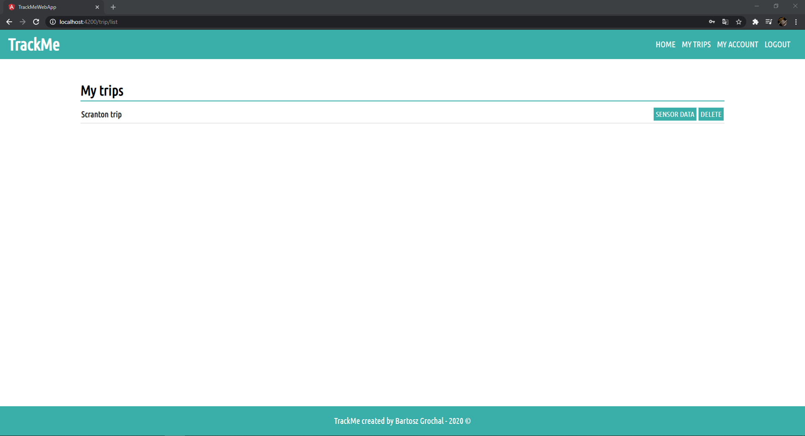
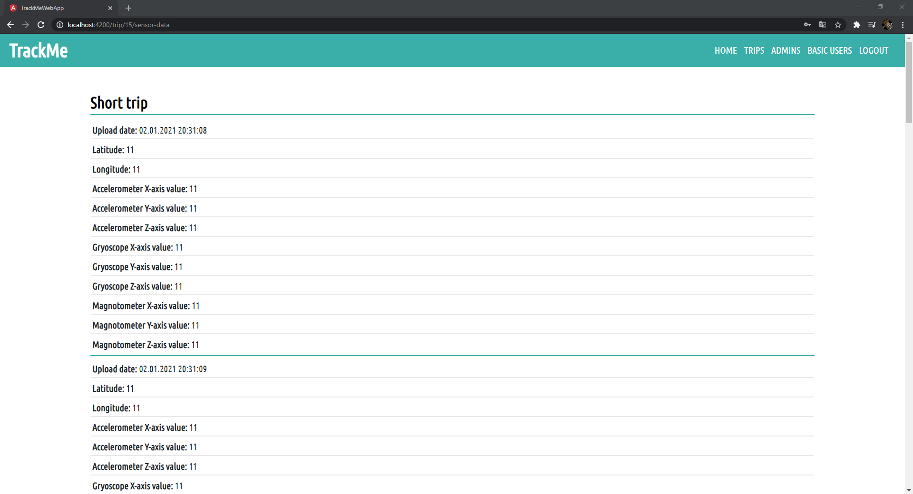
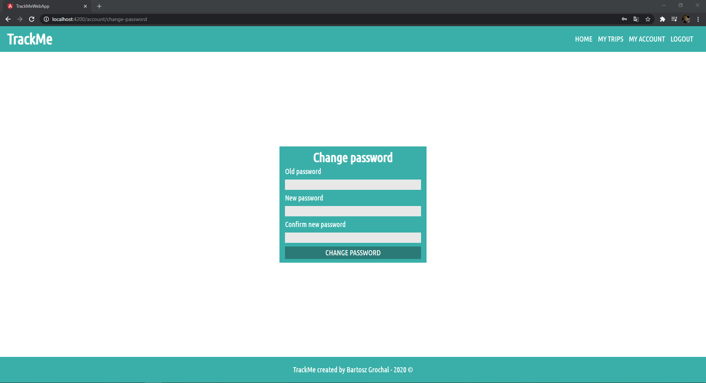
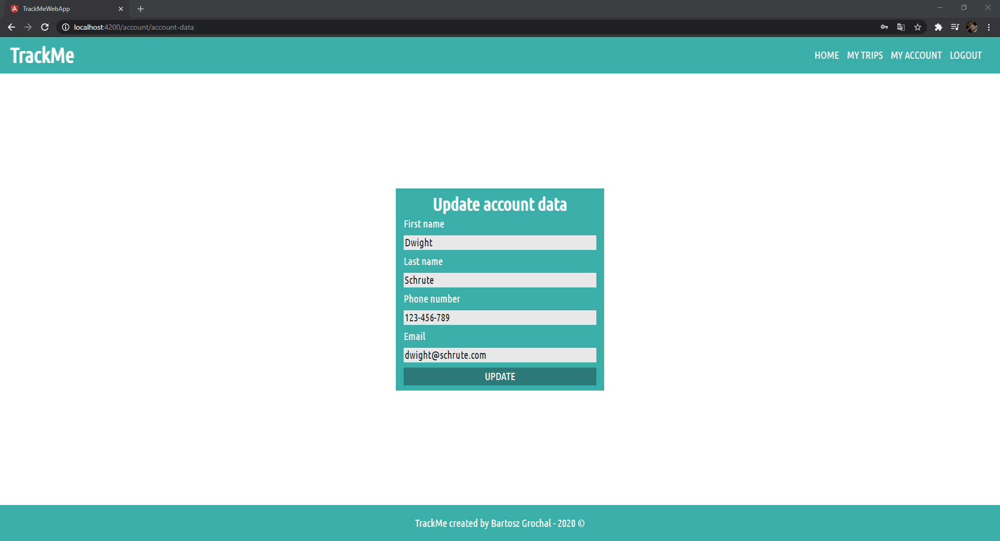

Admin can perform CRUD operations on database.

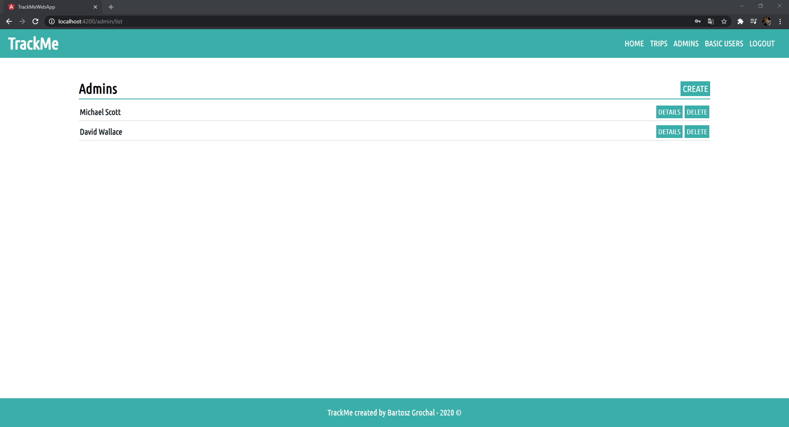
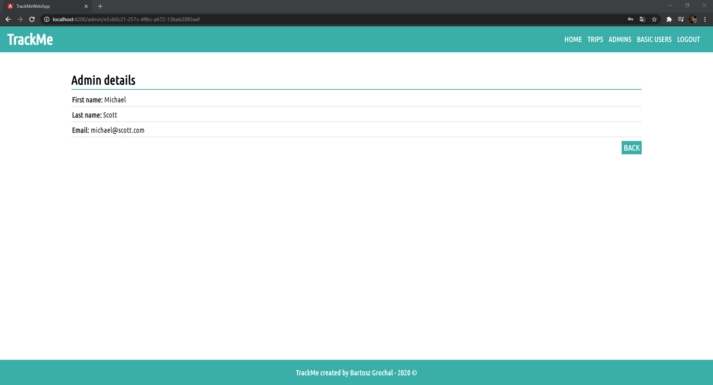
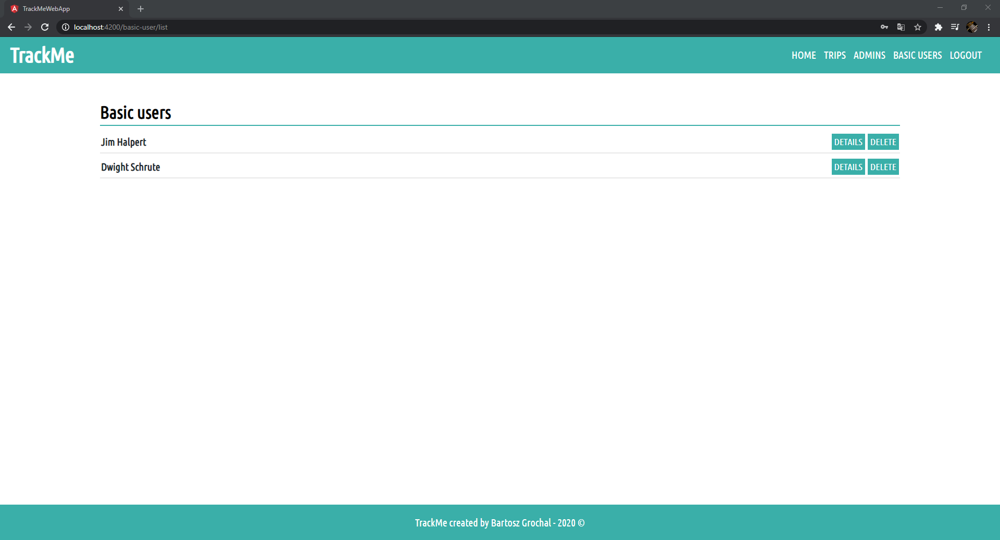
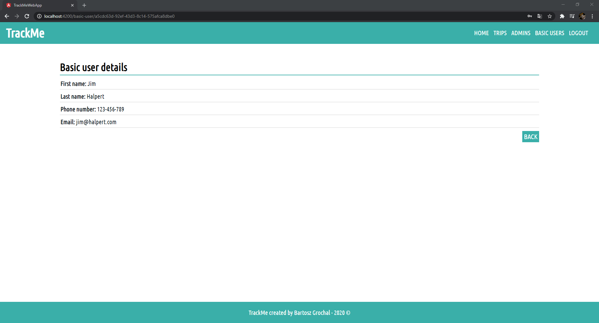
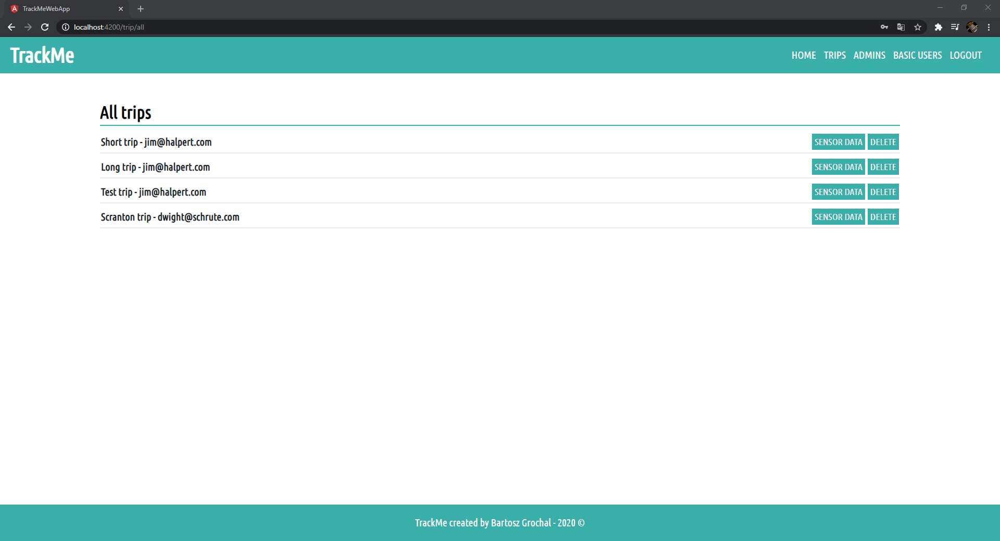
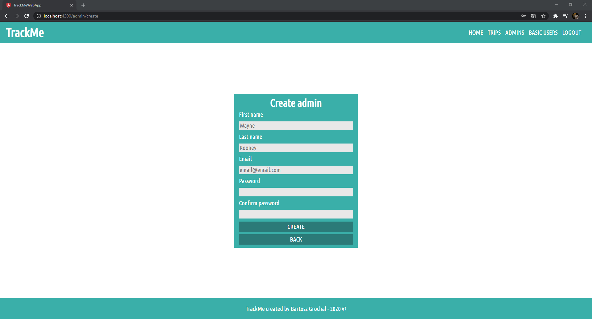

## Screenshots

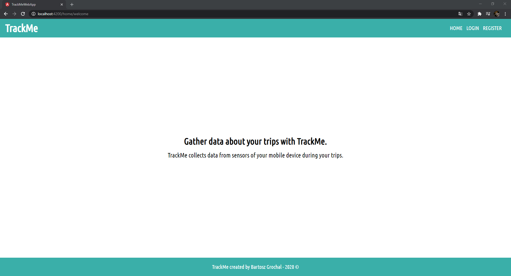
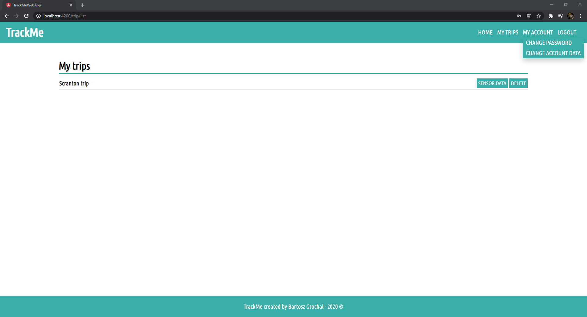

## Technologies
* Angular 11
* Font Awesome 4.7.0
* ngx-toastr 11.1.2
* RxJS 6.6.3 

## Status
Project is finished.
